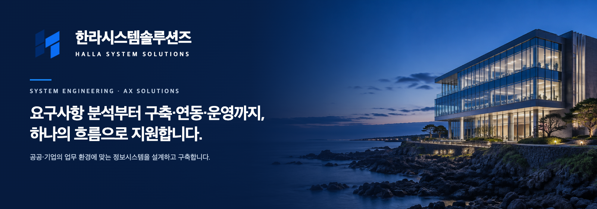
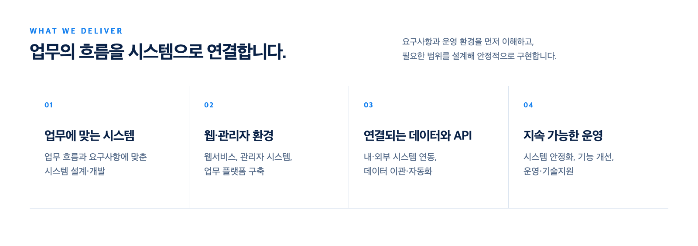
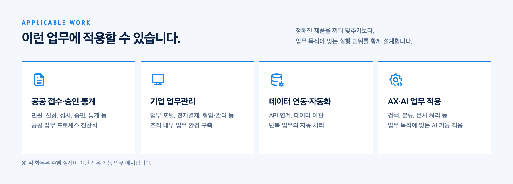
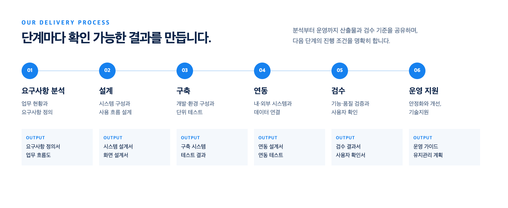
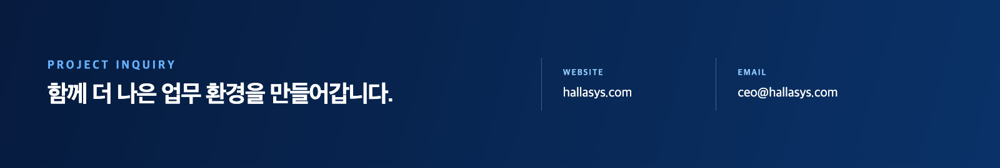

  <a href="https://hallasys.com">
    <picture>
      <source media="(max-width: 600px)" srcset="../assets/profile-hero-mobile.png" />
      
    </picture>
  </a>

  <a href="https://hallasys.com"><strong>Website</strong></a>
  &nbsp;·&nbsp;
  <a href="mailto:ceo@hallasys.com"><strong>Project Inquiry</strong></a>

 

<picture>
  <source media="(max-width: 600px)" srcset="../assets/profile-capabilities-mobile.png" />
  
</picture>

 

<picture>
  <source media="(max-width: 600px)" srcset="../assets/profile-applicable-work-mobile.png" />
  
</picture>

 

<picture>
  <source media="(max-width: 600px)" srcset="../assets/profile-process-mobile.png" />
  
</picture>

 

<a href="mailto:ceo@hallasys.com">
  <picture>
    <source media="(max-width: 600px)" srcset="../assets/profile-contact-mobile.png" />
    
  </picture>
</a>

  
<strong>텍스트로 사업 범위 확인하기</strong>

   

  한라시스템솔루션즈는 공공·기업의 업무 환경에 맞는 정보시스템을 설계하고 구축합니다.

  - 맞춤형 시스템 개발
  - 웹·업무 시스템 구축
  - 시스템 연동 및 자동화
  - 운영·유지관리
  - AX 전환 및 AI 업무 적용

  수행 절차는 요구사항 분석 → 설계 → 구축 → 연동 → 검수 → 운영 지원으로 진행합니다.

