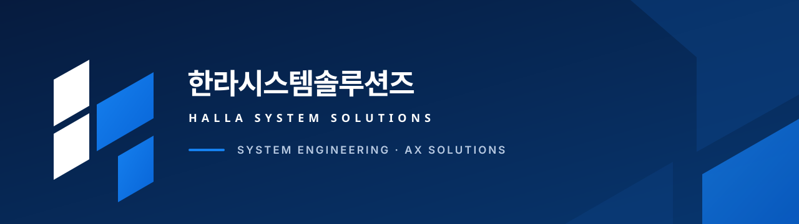
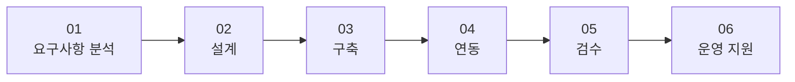

  

  공공·기업의 업무 환경에 맞는 정보시스템을 설계하고 구축합니다.

## 주요 사업

| 분야 | 제공 범위 |
| --- | --- |
| 맞춤형 시스템 개발 | 요구사항과 업무 흐름에 맞춘 시스템 설계·개발 |
| 웹·업무 시스템 구축 | 웹서비스, 관리자 시스템, 업무 플랫폼 구축 |
| 시스템 연동 및 자동화 | API 연계, 데이터 이관, 반복 업무 자동화 |
| 운영·유지관리 | 시스템 안정화, 기능 개선 및 기술지원 |
| AX 전환 및 AI 업무 적용 | 검색, 분류, 문서 처리 등 업무 목적에 맞는 AI 적용 |

## 수행 절차

프로젝트의 목적과 현재 업무를 먼저 이해하고, 단계별 산출물과 검수 기준을 공유하며 진행합니다.

## Contact

- Website: [hallasys.com](https://hallasys.com)
- Email: [ceo@hallasys.com](mailto:ceo@hallasys.com)
- Location: Jeju, Republic of Korea
